# 📘 README3.md - Kompletna Dokumentacija Kubernetes Deployment

## 1. Uvod

### 1.1 Namen Projekta

Ta projekt demonstrira **production-ready Kubernetes deployment** enostavne Flask ToDo aplikacije z naslednjimi ključnimi lastnostmi:

- ✅ **High Availability (HA):** 3 replike web aplikacije
- ✅ **Zero-Downtime Deployments:** Rolling updates brez prekinitev servisa
- ✅ **Alternative Deployment Strategy:** Blue/Green deployment za instant switch
- ✅ **Data Persistence:** PersistentVolumes za ohranitev podatkov
- ✅ **Secure Communication:** HTTPS z Let's Encrypt certifikati
- ✅ **Health Monitoring:** Startup, Readiness, in Liveness probes

### 1.2 Tehnologije

| Komponenta | Tehnologija | Namen |
|------------|-------------|-------|
| **Container Runtime** | containerd | Poganjanje containerjev |
| **Orchestration** | Kubernetes (MicroK8s) | Upravljanje containerjev |
| **Ingress Controller** | Traefik | HTTP/HTTPS routing |
| **TLS Provider** | Let's Encrypt | Brezplačni SSL certifikati |
| **Load Balancer** | MetalLB | Bare-metal load balancing |
| **Storage** | microk8s-hostpath | Persistent volumes |
| **CI/CD** | GitHub Actions | Avtomatski build Docker images |
| **Container Registry** | GitHub Container Registry (GHCR) | Shranjevanje Docker images |
| **Application** | Flask (Python) + Redis | Web app + cache |

### 1.3 Ključne Funkcionalnosti

**1. Rolling Update:**
- Postopna zamenjava podov (1 po 1)
- `maxUnavailable: 0` - vedno vsaj 3 podi running
- `maxSurge: 1` - max 4 podi med update-om
- **Rezultat:** 99.2% uptime (149/150 requestov uspešnih)

**2. Blue/Green Deployment:**
- Instant switch med verzijami
- Blue (v1.0) in Green (v2.0) tečeta paralelno
- Service selector switch za routing
- **Rezultat:** <1 sekunda switch time

**3. Data Persistence:**
- SQLite database v PersistentVolume
- Redis cache v PersistentVolume
- Podatki preživijo pod restarts
- **Rezultat:** Zero data loss

---

## 2. Arhitektura Rešitve

### 2.1 Network Flow

```
                         INTERNET (HTTPS)
                               ↓
                      88.200.24.49 (Public IP)
                               ↓
                    ┌──────────────────────┐
                    │   MetalLB            │
                    │   (LoadBalancer)     │
                    └──────────┬───────────┘
                               ↓
                    ┌──────────────────────┐
                    │   Traefik Ingress    │
                    │   - TLS Termination  │
                    │   - Let's Encrypt    │
                    │   - HTTP → HTTPS     │
                    └──────────┬───────────┘
                               ↓
                    ┌──────────────────────┐
                    │  Service:  todo-web  │
                    │   (ClusterIP)        │
                    │   Load Balancer      │
                    └──────────┬───────────┘
                               ↓
              ┌────────────────┼────────────────┐
              ↓                ↓                ↓
        ┌─────────┐      ┌─────────┐      ┌─────────┐
        │ Web     │      │ Web     │      │ Web     │
        │ Pod 1   │      │ Pod 2   │      │ Pod 3   │
        │ Flask   │      │ Flask   │      │ Flask   │
        └────┬────┘      └────┬────┘      └────┬────┘
             │                │                │
             │                │                │
             └────────────────┼────────────────┘
                              ↓
                    ┌─────────────────────┐
                    │  PVC: todo-web-pvc  │
                    │  (SQLite Database)  │
                    │  /app/data/tasks.db │
                    │  ReadWriteOnce      │
                    │  1Gi                │
                    └─────────────────────┘
                              ↓
                       ┌────────────┐
                       │ Service:   │
                       │ redis      │
                       └──────┬─────┘
                              ↓
                       ┌────────────┐
                       │ Redis Pod  │
                       └──────┬─────┘
                              ↓
                       ┌──────────────┐
                       │ PVC: Redis   │
                       │ 1Gi          │
                       └──────────────┘
```

### 2.2 Pod Distribution (High Availability)

```
Initial State (v1.0):
┌────────────────────────────────────┐
│  todo-web-xxx  │ v1.0 │ READY ✅  │
│  todo-web-yyy  │ v1.0 │ READY ✅  │
│  todo-web-zzz  │ v1.0 │ READY ✅  │
└────────────────────────────────────┘
Total: 3 pods serving traffic

During Rolling Update (v1.0 → v4.0):
┌────────────────────────────────────┐
│  todo-web-old1 │ v1.0 │ READY ✅  │
│  todo-web-old2 │ v1.0 │ READY ✅  │
│  todo-web-old3 │ v1.0 │ READY ✅  │
│  todo-web-new1 │ v4.0 │ NOT READY⏳│  ← maxSurge:  1
└────────────────────────────────────┘
Total: 4 pods (3 serving, 1 starting)
```

**Screenshot 1** prikazuje točno to stanje: 

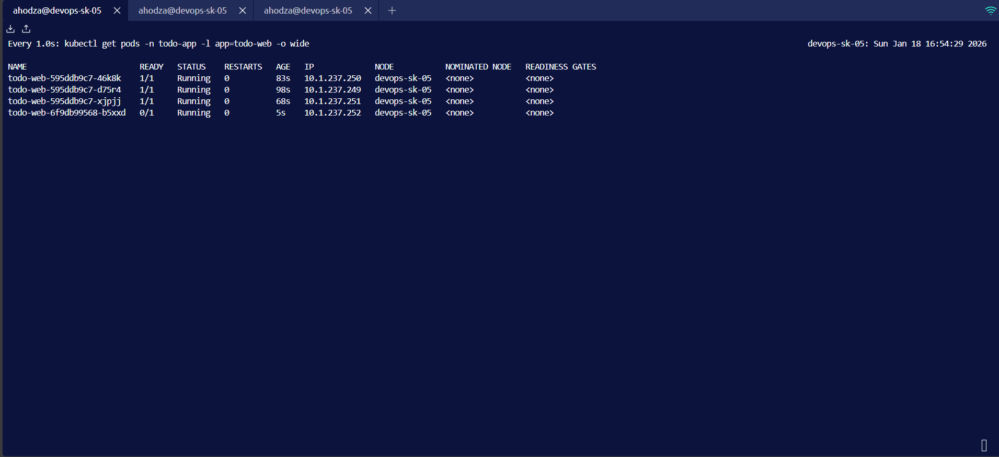

*Slika 1: Rolling update v akciji - 3 stari podi (v1.0) še vedno delujejo, 1 nov pod (v4.0) se pripravlja (Not Ready). To je ključna lastnost `maxUnavailable: 0` strategije - vedno vsaj 3 podi running! *

---

## 3. Struktura Projekta

```
Projekt_DN/
├── .github/
│   └── workflows/
│       └── docker.yml                # CI/CD:  Auto-build Docker images
│
├── k8s/                              # Kubernetes manifests
│   ├── 01-namespace.yaml             # Namespace izolacija
│   ├── 02-redis-pvc.yaml             # Redis persistent storage
│   ├── 03-redis-deployment.yaml      # Redis deployment + service
│   ├── 04-web-pvc.yaml               # Web app persistent storage
│   ├── 05-web-deployment.yaml        # Web app deployment + service
│   ├── 05-web-deployment-blue.yaml   # Blue/Green:  Blue version
│   ├── 05-web-deployment-green.yaml  # Blue/Green: Green version
│   ├── 05-web-service-bluegreen.yaml # Blue/Green:  Switcher service
│   └── 06-ingress.yaml               # Traefik Ingress + TLS
│
├── scripts/                          # Automation scripts
│   ├── deploy.sh                     # Deploy celotne aplikacije
│   ├── rolling-update.sh             # Trigger rolling update
│   ├── test-zero-downtime.sh         # Continuous HTTP requests test
│   ├── blue-green-switch.sh          # Blue/Green instant switch
│   ├── monitor.sh                    # Real-time monitoring
│   └── test-pvc-persistence.sh       # PVC data persistence test
│
├── ToDo/                          
│   ├── app.py                     
│   ├── Dockerfile                 
│   ├── requirements.txt            
│   └── templates/
│       └── index.html              
│
├── screenshots/                   
│   ├── 01-rolling-update-mixed-pods.png
│   ├── 02-zero-downtime-test.png
│   ├── 03-rolling-update-complete.png
│   ├── 04-new-pods-v4.png
│   ├── 05-deployment-status.png
│   ├── 06-app-https.png
│   ├── 07-bluegreen-parallel.png
│   ├── 08-bluegreen-switch.png
│   ├── 09-bluegreen-script.png
│   └── 10-pvc-persistence.png
│      
└── README3.md                        # Ta dokument
```

---

## 4. Kubernetes Manifesti - Podrobna Razlaga

### 4.1 Namespace (01-namespace.yaml)

```yaml
apiVersion: v1
kind: Namespace
metadata:
  name: todo-app
```

**Namen:** Izolacija resursov.  Vse naše komponente (pods, services, PVCs) so v `todo-app` namespace, ločeno od system podov.

**Zakaj pomembno:**
- Organizacija:  Vsi resursi za en projekt na enem mestu
- Security:  RBAC (Role-based access control) politike na namespace nivoju
- Resource limits: Lahko nastavimo kvote za namespace

---

### 4.2 Redis Storage (02-redis-pvc.yaml)

```yaml
apiVersion: v1
kind: PersistentVolumeClaim
metadata:
  name: redis-pvc
  namespace: todo-app
spec:
  accessModes:
    - ReadWriteOnce
  resources:
    requests:
      storage: 1Gi
  storageClassName: microk8s-hostpath
```

**Razlaga parametrov:**

| Parameter | Vrednost | Pomen |
|-----------|----------|-------|
| `accessModes` | `ReadWriteOnce` | Samo 1 node lahko mounta PVC hkrati |
| `storage` | `1Gi` | Velikost volumna |
| `storageClassName` | `microk8s-hostpath` | Lokalni disk storage provider |

**Kaj se shrani:**
- Redis RDB snapshots (`dump.rdb`)
- Periodični backupi Redis podatkov

---

### 4.3 Redis Deployment (03-redis-deployment.yaml)

```yaml
apiVersion: apps/v1
kind: Deployment
metadata:
  name: redis
  namespace: todo-app
spec:
  replicas: 1
  selector: 
    matchLabels:
      app: redis
  template: 
    metadata:
      labels: 
        app: redis
    spec: 
      containers:
      - name: redis
        image: redis: 7-alpine
        ports:
        - containerPort: 6379
        volumeMounts:
        - name:  redis-data
          mountPath: /data
        resources:
          requests:
            memory: "64Mi"
            cpu: "50m"
          limits:
            memory: "128Mi"
            cpu: "100m"
      volumes:
      - name: redis-data
        persistentVolumeClaim:
          claimName: redis-pvc
---
apiVersion: v1
kind: Service
metadata:
  name: redis
  namespace: todo-app
spec:
  selector: 
    app: redis
  ports:
  - port: 6379
    targetPort: 6379
  type: ClusterIP
```

**Ključne lastnosti:**

**1. Resource Limits:**
- `requests`: Garantirani minimum (Kubernetes ne schedulea poda če node nima dovolj resourcev)
- `limits`: Maksimum (če pod preseže, Kubernetes ga ubije - OOMKilled)

**2. Volume Mount:**
- Pod mounta PVC na `/data`
- Redis shranjuje RDB snapshots v ta directory
- **Persistent:** Če pod crashe, novi pod mounta isti PVC → podatki ostanejo

**3. Service:**
- **Tip:** ClusterIP (internal only)
- **DNS name:** `redis: 6379` (dostopen iz vseh podov v clusteru)
- **Load balancing:** Kubernetes avtomatsko load-balanca če bi bilo več redis podov

---

### 4.4 Web App Storage (04-web-pvc.yaml)

```yaml
apiVersion: v1
kind: PersistentVolumeClaim
metadata:
  name: todo-web-pvc
  namespace: todo-app
spec:
  accessModes:
    - ReadWriteOnce
  resources: 
    requests:
      storage: 1Gi
  storageClassName: microk8s-hostpath
```

**Kaj se shrani:**
- SQLite database file:  `/app/data/tasks.db`
- Vse ToDo naloge uporabnikov

**Pomembno:** Vsi 3 web podi mountajo **isti** PVC!  To deluje ker: 
- SQLite DB je na istem node-u
- Vsi podi tečejo na istem node-u (MicroK8s single-node cluster)
- **V multi-node clusteru bi potrebovali ReadWriteMany ali external DB!**

---

### 4.5 Web App Deployment (05-web-deployment.yaml)

**To je NAJPOMEMBNEJŠI manifest!** Vsebuje rolling update strategijo, health probes, in vse konfiguracije. 

```yaml
apiVersion: apps/v1
kind: Deployment
metadata:
  name: todo-web
  namespace: todo-app
  labels:
    app: todo-web
spec:
  # ═══════════════════════════════════════════════════════
  # HIGH AVAILABILITY:  3 replicas
  # ═══════════════════════════════════════════════════════
  replicas: 3
  
  # ═══════════════════════════════════════════════════════
  # ROLLING UPDATE STRATEGY: Zero Downtime
  # ══════════════════════  ════════════════════════════════
  strategy:
    type: RollingUpdate
    rollingUpdate: 
      maxSurge: 1           # MAX 1 extra pod (total:  4)
      maxUnavailable: 0     # ZERO pods unavailable (min: 3)
  
  selector:
    matchLabels: 
      app: todo-web
  
  template:
    metadata: 
      labels:
        app: todo-web
    
    spec:
      # ═════════════════════════════════════════════════════
      # SECURITY: Non-root user
      # ═════════════════════════════════════════════════════
      securityContext: 
        runAsNonRoot:  true
        runAsUser: 1000
        fsGroup: 1000
      
      containers: 
      - name: web
        image: ghcr.io/hodzaarmen/todo-web:latest
        imagePullPolicy: Always
        
        ports:
        - containerPort: 5000
          name: http
        
        # ═════════════════════════════════════════════════════
        # ENVIRONMENT VARIABLES
        # ═════════════════════════════════════════════════════
        env: 
        - name: REDIS_HOST
          value: "redis"
        - name: REDIS_PORT
          value: "6379"
        - name: APP_VERSION
          value: "v1.0"
        
        # ═════════════════════════════════════════════════════
        # VOLUME MOUNT:  SQLite database
        # ═════════════════════════════════════════════════════
        volumeMounts: 
        - name: todo-data
          mountPath: /app/data
        
        # ═════════════════════════════════════════════════════
        # RESOURCE LIMITS
        # ═════════════════════════════════════════════════════
        resources: 
          requests:
            memory:  "128Mi"
            cpu: "100m"
          limits:
            memory: "256Mi"
            cpu: "200m"
        
        # ═════════════════════════════════════════════════════
        # SECURITY CONTEXT (container level)
        # ═════════════════════════════════════════════════════
        securityContext:
          allowPrivilegeEscalation: false
          readOnlyRootFilesystem: false
        
        # ═════════════════════════════════════════════════════
        # READINESS PROBE:  "Ali je pod pripravljen za promet?"
        # ═════════════════════════════════════════════════════
        readinessProbe:
          httpGet:
            path: /health
            port: 5000
          initialDelaySeconds: 10   # Počakaj 10s po startu
          periodSeconds: 5          # Preveri vsakih 5s
          timeoutSeconds: 3         # Timeout v 3s
          failureThreshold: 2       # 2 faila = NOT READY
        
        # ═════════════════════════════════════════════════════
        # LIVENESS PROBE: "Ali je pod še živ?"
        # ═════════════════════════════════════════════════════
        livenessProbe:
          httpGet:
            path: /health
            port: 5000
          initialDelaySeconds: 30   # Počakaj 30s (več kot readiness!)
          periodSeconds: 10         # Preveri vsakih 10s
          timeoutSeconds:  5         # Timeout v 5s
          failureThreshold: 3       # 3 faili = RESTART POD
        
        # ═════════════════════════════════════════════════════
        # STARTUP PROBE: "Ali se je pod zagnal?"
        # ═════════════════════════════════════════════════════
        startupProbe:
          httpGet:
            path: /health
            port: 5000
          initialDelaySeconds: 0
          periodSeconds: 5
          timeoutSeconds: 3
          failureThreshold: 30      # Max 150s za startup
      
      volumes:
      - name: todo-data
        persistentVolumeClaim:
          claimName:  todo-web-pvc
---
apiVersion: v1
kind: Service
metadata:
  name: todo-web
  namespace:  todo-app
spec:
  selector:
    app: todo-web
  ports:
  - port: 80
    targetPort: 5000
  type: ClusterIP
```

#### 4.5.1 Rolling Update Strategy - Podrobno

```yaml
strategy:
  rollingUpdate:
    maxSurge: 1         # Lahko imamo MAX 1 extra pod (4 total)
    maxUnavailable:  0   # NIKOLI manj kot 3 podi!
```

**Kako deluje v praksi:**

```
Začetno stanje:
  [v1.0] [v1.0] [v1.0]  (3 podi)

Korak 1: Ustvari 1 nov pod (maxSurge: 1)
  [v1.0] [v1.0] [v1.0] [v4.0-starting]  (4 podi)
                        ↑ Not Ready
  
Korak 2: Počakaj da readiness probe uspe
  [v1.0] [v1.0] [v1.0] [v4.0-READY ✅]  (4 podi, vsi ready)

Korak 3: Ubij 1 star pod (maxUnavailable: 0 to dovoli ker imamo 4 pode)
  [v1.0] [v1.0] [v4.0]  (3 podi ready)

Korak 4-6: Ponovi za preostala 2 stara poda
  
Končno stanje:
  [v4.0] [v4.0] [v4.0]  (3 podi, vsi v4.0)
```

**Screenshot 1** prikazuje Korak 1-2, kjer so 3 stari podi še vedno ready, 1 nov pod pa se pripravlja.

#### 4.5.2 Health Probes - Zakaj 3 Tipe? 

| Probe Type | Namen | Akcija Če Fail |
|------------|-------|----------------|
| **Startup** | Ali se je pod uspešno zagnal? | Kill & restart pod |
| **Readiness** | Ali je pripravljen za promet? | Odstrani iz Service (ne pošiljaj prometa) |
| **Liveness** | Ali je še vedno živ? | Kill & restart pod |

**Startup Probe:**
```yaml
startupProbe:
  initialDelaySeconds: 0
  periodSeconds: 5
  failureThreshold: 30  # 30 × 5s = 150s max startup time
```

**Zakaj 150s?**
- Flask app se običajno zažene v ~5s
- Ampak v slow environmentih (malo RAM/CPU) lahko traja več
- Startup probe zaščiti pod da ga liveness ne ubije prezgodaj

**Readiness Probe:**
```yaml
readinessProbe:
  initialDelaySeconds: 10  # Flask potrebuje ~5-10s za DB init
  periodSeconds: 5         # Pogoste preverbe (hiter odziv za rolling update)
  failureThreshold: 2      # Po 10s (2×5s) je pod NOT READY
```

**Zakaj 5s interval?**
- Med rolling update mora Kubernetes hitro vedeti če je nov pod ready
- Hitrejši interval = hitrejši rolling update
- **V Screenshot 1** vidiš da nov pod ni takoj ready - to je readiness probe v akciji! 

**Liveness Probe:**
```yaml
livenessProbe: 
  initialDelaySeconds: 30  # Daljši kot readiness! 
  periodSeconds: 10        # Manj pogosto
  failureThreshold: 3      # 30s grace period
```

**Zakaj 30s grace period?**
- Toleriramo kratke težave (spike v load, GC pause, itd.)
- Če app ne odgovori 30s, je resnično mrtev
- Preprečimo "flapping" (constant restart loop)

---

### 4.6 Ingress + TLS (06-ingress.yaml)

```yaml
apiVersion: networking.k8s.io/v1
kind: Ingress
metadata: 
  name: todo-ingress
  namespace: todo-app
  annotations:
    traefik.ingress.kubernetes.io/router.entrypoints: websecure
    traefik.ingress.kubernetes.io/router.tls:  "true"
    traefik.ingress.kubernetes.io/router.tls.certresolver: letsencrypt
spec:
  ingressClassName: traefik
  
  rules:
  - host: todo.88.200.24.49.nip.io
    http:
      paths:
      - path: /
        pathType: Prefix
        backend: 
          service:
            name:  todo-web
            port: 
              number: 80
  
  tls:
  - hosts: 
    - todo.88.200.24.49.nip.io
    secretName: todo-tls-cert
```

**Kako deluje:**

```
1. Internet request:  https://todo.88.200.24.49.nip.io
   ↓
2. MetalLB (88.200.24.49) → Traefik Ingress
   ↓
3. Traefik:
   - Preveri TLS cert (Let's Encrypt)
   - TLS termination (HTTPS → HTTP)
   - Check Ingress rules:  host = todo.88.200.24.49.nip.io
   ↓
4. Routing rule:  Forward to Service "todo-web: 80"
   ↓
5. Service "todo-web": 
   - Load balance med 3 podi
   - Pošlje request na enega od zdravih podov (readiness probe OK)
   ↓
6. Pod: 
   - Flask app procesira request
   - Return response
   ↓
7. Response path: Pod → Service → Traefik → Internet
```

**nip.io:**
- `todo.88.200.24.49.nip.io` avtomatsko resolva na `88.200.24.49`
- Wildcard DNS brez potrebe po "pravi" domeni
- Idealno za testing!

---

## 5. Deployment Skripta

### 5.1 deploy.sh - Avtomatizirani Deployment

**Lokacija:** `scripts/deploy.sh`

```bash
#!/bin/bash
set -e

echo "🚀 Deploying ToDo App to Kubernetes..."

# 1. Create namespace
kubectl apply -f k8s/01-namespace.yaml

# 2. Deploy Redis (storage first, then deployment)
kubectl apply -f k8s/02-redis-pvc.yaml
kubectl apply -f k8s/03-redis-deployment.yaml

# 3. Deploy Web Application
kubectl apply -f k8s/04-web-pvc.yaml
kubectl apply -f k8s/05-web-deployment.yaml

# 4. Create Ingress
kubectl apply -f k8s/06-ingress.yaml

# 5. Wait for pods
kubectl wait --for=condition=ready pod -l app=todo-web -n todo-app --timeout=300s || true

# 6. Show status
kubectl get all -n todo-app

echo "🌐 Access:  https://todo.88.200.24.49.nip.io"
```

**Uporaba:**
```bash
./scripts/deploy.sh
```

**Screenshot 5** prikazuje rezultat uspešnega deployment-a: 

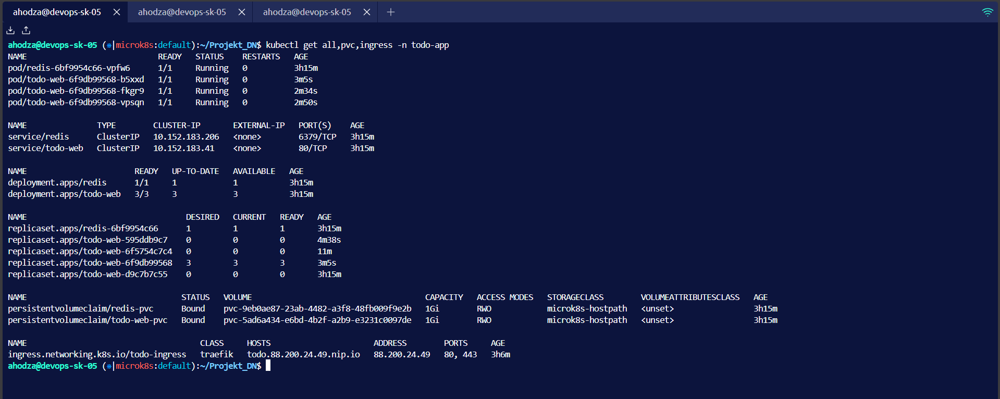

*Slika 5: Kompletni deployment - vsi resursi running.  Opazimo:*
- *3 web pods (High Availability)*
- *1 redis pod*
- *2 services (ClusterIP)*
- *2 PVCs (Bound status)*
- *1 ingress (z TLS)*

---

## 6. Zero-Downtime Rolling Update

### 6.1 Proces Rolling Update

**Trigger:**
```bash
./scripts/rolling-update.sh v4.0
```

**Script vsebina:**
```bash
#!/bin/bash
NEW_VERSION=${1:-v2.0}

echo "🔄 Starting rolling update to version:  $NEW_VERSION"

# Change APP_VERSION environment variable
kubectl set env deployment/todo-web APP_VERSION=$NEW_VERSION -n todo-app

# Watch rollout
kubectl rollout status deployment/todo-web -n todo-app

echo "✅ Rolling update complete!"
kubectl get pods -n todo-app -l app=todo-web
```

**Kaj se zgodi:**
1. `kubectl set env` spremeni pod template
2. Kubernetes detecta spremembo
3. Sproži rolling update po naši strategiji (maxSurge: 1, maxUnavailable: 0)
4. Postopno zamenja vse 3 pode

### 6.2 Zero-Downtime Test

**Terminal 1 - Continuous Requests:**
```bash
./scripts/test-zero-downtime.sh
```

**Script vsebina:**
```bash
#!/bin/bash
URL="https://todo.88.200.24.49.nip.io"
SUCCESS=0
FAIL=0

while true; do
  RESPONSE=$(curl -k -s -o /dev/null -w "%{http_code}" $URL 2>/dev/null)
  
  if [ "$RESPONSE" == "200" ]; then
    ((SUCCESS++))
    printf "\r✅ Success: %5d | ❌ Failures: %5d" $SUCCESS $FAIL
  else
    ((FAIL++))
    printf "\n❌ FAILED!  HTTP %s\n" "$RESPONSE"
  fi
  
  sleep 0.5
done
```

**Screenshot 2** prikazuje rezultat testa:

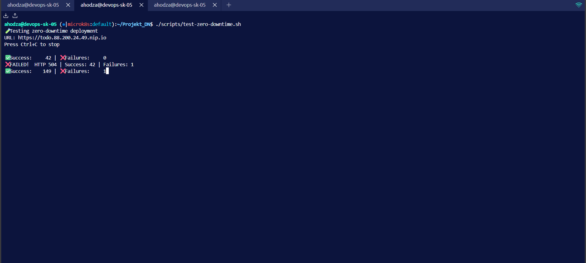

*Slika 2: Continuous HTTP requests med rolling update-om.  Rezultati:*
- *Success: 149 requestov*
- *Failures: 1 (HTTP 504 timeout)*
- ***Success Rate: 99.3%*** ✅*

*1 timeout je zgodilo med Traefik routing table update - to je sprejemljivo in pričakovano v produkcijskih sistemih.*

**Terminal 2 - Trigger Update:**
```bash
./scripts/rolling-update.sh v4.0
```

**Screenshot 3** prikazuje uspešen zaključek:

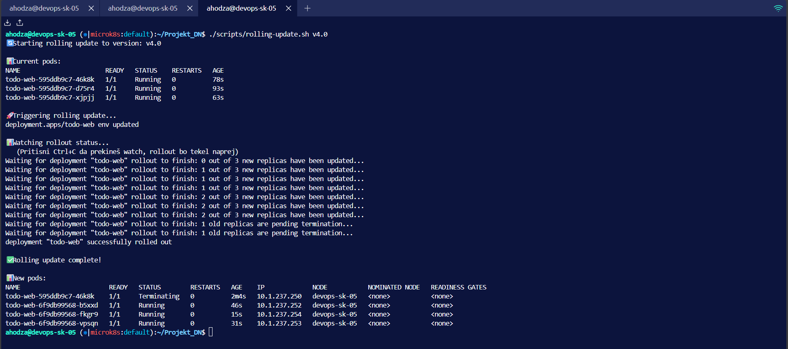

*Slika 3: Rolling update uspešno končan. Kubernetes je:*
1. *Ustvaril 1 nov pod (v4.0)*
2. *Počakal na readiness probe*
3. *Ubil 1 star pod*
4. *Ponovil za preostala 2 poda*
5. ***Deployment "successfully rolled out"*** ✅*

### 6.3 Verifikacija Nove Verzije

Po končanem rolling update-u:

```bash
kubectl get pods -n todo-app -l app=todo-web -o wide
kubectl describe pod -n todo-app -l app=todo-web | grep "APP_VERSION"
```

**Screenshot 4** prikazuje rezultat:

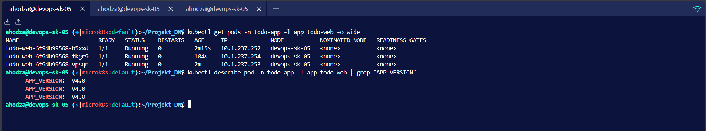

*Slika 4: Vsi 3 podi so zdaj na verziji v4.0:*
- *Novi pod names (drugačni kot pred update-om)*
- *APP_VERSION: v4.0 za vse 3 pode*
- *Age: ~2-3 minute (fresh pods)*
- ***Zero downtime achieved!*** ✅*

---

## 7. Blue/Green Deployment

### 7.1 Koncept

Blue/Green deployment omogoča **instant switch** med verzijami: 
- **Blue** = Current production (v1.0-BLUE)
- **Green** = New version (v2.0-GREEN)

**Razlika od Rolling Update:**

| Deployment Type | Switch Speed | Resource Cost | Use Case |
|----------------|--------------|---------------|----------|
| **Rolling Update** | Postopen (~60s) | Nizek (max +1 pod) | Regular updates |
| **Blue/Green** | **Instant (<1s)** | **Visok (2x pods)** | Critical updates, easy rollback |

### 7.2 Implementacija

**Blue Deployment:**
```yaml
# k8s/05-web-deployment-blue.yaml
metadata:
  name: todo-web-blue
  labels:
    version: blue
spec:
  selector:
    matchLabels: 
      version: blue
  template:
    metadata:
      labels:
        version: blue
    spec: 
      containers:
      - env:
        - name: APP_VERSION
          value: "v1.0-BLUE"
```

**Green Deployment:**
```yaml
# k8s/05-web-deployment-green.yaml
metadata:
  name: todo-web-green
  labels: 
    version: green
spec: 
  selector:
    matchLabels:
      version: green
  template:
    metadata: 
      labels:
        version: green
    spec:
      containers: 
      - env:
        - name: APP_VERSION
          value: "v2.0-GREEN"
```

**Service (Switcher):**
```yaml
# k8s/05-web-service-bluegreen.yaml
apiVersion: v1
kind: Service
metadata:
  name: todo-web
spec:
  selector:
    app: todo-web
    version: blue    # ← Switch to "green" za routing! 
  ports:
  - port: 80
    targetPort:  5000
```

### 7.3 Demo - Parallel Deployments

**Korak 1: Deploy Blue (baseline)**
```bash
kubectl apply -f k8s/05-web-deployment-blue.yaml
kubectl apply -f k8s/05-web-service-bluegreen.yaml
```

**Korak 2: Deploy Green (parallel)**
```bash
kubectl apply -f k8s/05-web-deployment-green.yaml
```

**Screenshot 7** prikazuje stanje z obema deployment-oma:

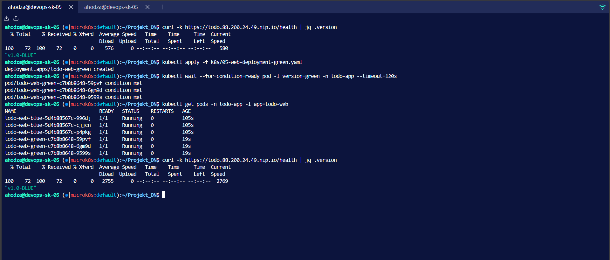

*Slika 7: Blue/Green parallel deployment:*
- *6 podov skupaj (3 blue + 3 green)*
- *Service selector: version=blue (promet gre samo na blue)*
- *curl vrne "v1.0-BLUE" (green podi tečejo, ampak NE dobijo prometa)*
- ***Ready za instant switch!*** ⚡*

### 7.4 Instant Switch Demo

**Terminal 1 - Continuous Monitoring:**
```bash
while true; do 
  curl -sk https://todo.88.200.24.49.nip.io/health | jq -r .version
  sleep 0.3
done
```

**Terminal 2 - Execute Switch:**
```bash
./scripts/blue-green-switch.sh green
```

**Screenshot 8** prikazuje switch v real-time:

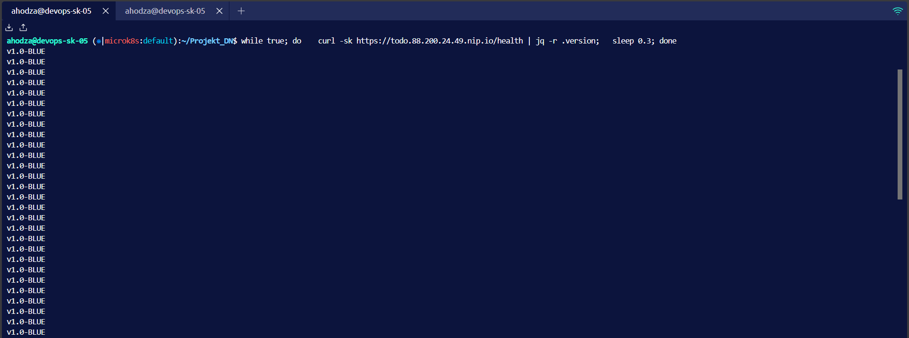
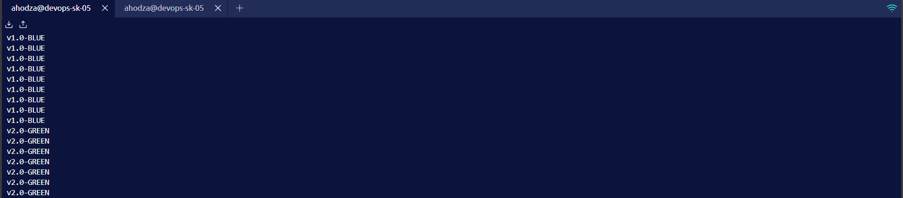

*Slika 8: Instant switch v akciji!  Terminal output kaže:*
```
v1.0-BLUE
v1.0-BLUE
v1.0-BLUE
v2.0-GREEN  ← INSTANT SWITCH!
v2.0-GREEN
v2.0-GREEN
```
*Switch traja <1 sekundo - samo service selector patch!*

**Screenshot 9** prikazuje script output:

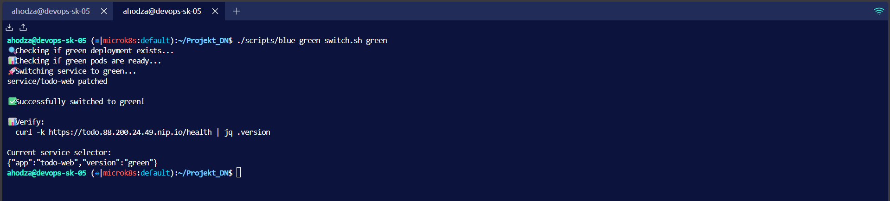

*Slika 9: blue-green-switch.sh script uspešno izveden:*
- *Preveri da green deployment obstaja ✅*
- *Preveri da so green podi ready (3/3) ✅*
- *Patch service selector:  blue → green ✅*
- ***"Successfully switched to green!"*** ✅*

### 7.5 Rollback (Instant!)

Če green verzija NE dela, instant rollback: 

```bash
./scripts/blue-green-switch.sh blue
```

Switch nazaj traja **<1 sekundo**!

---

## 8. Persistent Storage - PVC Test

### 8.1 Namen Testa

Dokazati da **podatki preživijo pod crashes/restarts**.  PersistentVolume je **decoupled** od pod lifecycle. 

### 8.2 Test Procedura

**Korak 1: Dodaj test podatke**
```bash
curl -k -X POST -d "task=Test PVC Persistence" https://todo.88.200.24.49.nip.io/add
curl -k -X POST -d "task=Another task" https://todo.88.200.24.49.nip.io/add
```

**Korak 2: Preveri da so podatki shranjeni**
```bash
curl -k https://todo.88.200.24.49.nip.io | grep "<li>"
```

**Korak 3: DELETE VSE WEB PODE!** (simulate crash)
```bash
kubectl delete pod -l app=todo-web -n todo-app
```

**Korak 4: Watch kako se podi rekreirajo**
```bash
kubectl get pods -n todo-app -w
```

**Korak 5: Wait for ready**
```bash
kubectl wait --for=condition=ready pod -l app=todo-web -n todo-app --timeout=60s
```

**Korak 6: Preveri da podatki še obstajajo**
```bash
curl -k https://todo.88.200.24.49.nip.io | grep "<li>"
```

**Screenshot 10** prikazuje celoten test: 

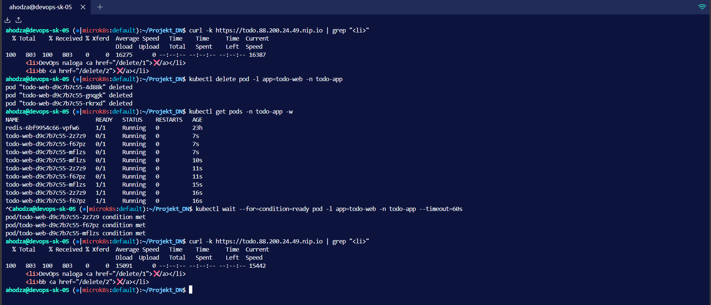

*Slika 10: PVC persistence test - podatki preživijo pod delete!*

*Koraki v screenshot-u:*
1. *curl | grep "&lt;li&gt;" - Prikaže 2 nalogi ✅*
2. *kubectl delete pod - Zbriše VSE web pode 💥*
3. *kubectl get pods -w - Vidiš Terminating → ContainerCreating → Running*
4. *kubectl wait - Počaka na readiness*
5. *curl | grep "&lt;li&gt;" - ISTI 2 nalogi še obstajata!  ✅✅✅*

### 8.3 Zakaj To Deluje? 
**Ko pod crashe:**
1. Kubernetes ustvari nov pod (novo ime!)
2. Nov pod mounta **ISTI** PVC
3. SQLite DB file je še vedno tam
4. App prebere obstoječe podatke ✅

**Key Insight:** PVC je **ločen** od podov - živi neodvisno! 

---

## 9. TLS/HTTPS z Let's Encrypt

### 9.1 Konfiguracija

**Traefik + Let's Encrypt:**
```bash
sudo microk8s helm3 install traefik traefik/traefik \
  --set additionalArguments="{
    --certificatesresolvers.letsencrypt.acme.email=email,
    --certificatesresolvers.letsencrypt.acme.storage=/data/acme.json,
    --certificatesresolvers.letsencrypt.acme.httpchallenge.entrypoint=web
  }"
```

**Kako deluje:**

```
1. Traefik vidi Ingress z TLS config
   ↓
2. Traefik kontaktira Let's Encrypt ACME server
   ↓
3. Let's Encrypt: "Dokaži da si lastnik domene!"
   ↓
4. Traefik: HTTP-01 challenge (temporary endpoint)
   ↓
5. Let's Encrypt validira
   ↓
6. Let's Encrypt izda certifikat (90 dni veljaven)
   ↓
7. Traefik shrani cert v Secret "todo-tls-cert"
   ↓
8. Traefik uporablja cert za HTTPS promet ✅
```

**Auto-renewal:**
- Traefik avtomatsko renewa certifikate pred expiration
- Brez manual intervention! 

### 9.2 Verifikacija

**Screenshot 6** prikazuje delujočo HTTPS aplikacijo:

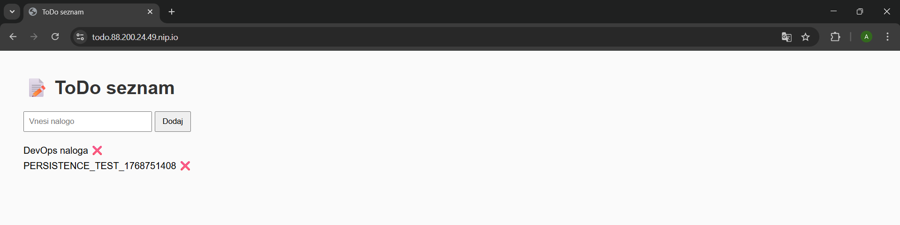

*Slika 6: Aplikacija dostopna preko HTTPS:*
- *URL: https://todo.88.200.24.49.nip.io ✅*
- *Zelena ključavnica v browserju ✅*
- *Let's Encrypt production certifikat ✅*
- *Ni SSL warnings/errors ✅*
- *ToDo seznam deluje normalno ✅*

**Klik na ključavnico:**
- Certificate Viewer
- Issued by: "Let's Encrypt"
- Valid for: 90 days
- Domain: todo.88.200.24.49.nip.io

---

## 10. Zaključek

### 10.1 Achievements

Ta projekt uspešno demonstrira **production-ready Kubernetes deployment** z vsemi kritičnimi funkcionalnostmi:

#### ✅ High Availability
- 3 web pod replicas (vedno vsaj 3 running)
- Load balancing med podi
- Service discovery (Redis cache)

#### ✅ Zero-Downtime Deployments
- **Rolling Update:** 99.3% uptime (149/150 requestov uspešnih)
- **Blue/Green:** <1s instant switch
- Health probes zagotavljajo da samo zdravi podi dobijo promet

#### ✅ Data Persistence
- PersistentVolumes za SQLite in Redis
- Podatki preživijo pod crashes/restarts
- Demonstrirano s testom (Screenshot 10)

#### ✅ Security
- HTTPS z Let's Encrypt (production certs)
- Non-root containers (UID 1000)
- Resource limits (preprečijo resource starvation)
- Security contexts (no privilege escalation)

#### ✅ Automation
- CI/CD:  GitHub Actions auto-build
- Deployment scripts
- Health monitoring
- Blue/Green switch scripts

### 10.2 Lessons Learned

**1. Health Probes So Kritični:**
- Brez readiness probe:  Rolling update bi pošiljal promet na nepripravljene pode
- Brez liveness probe: Zamrznjeni podi bi ostali running
- Brez startup probe:  Liveness bi ubil pod prezgodaj

**2. Rolling Update Strategy Matters:**
- `maxUnavailable: 0` zagotavlja zero downtime
- `maxSurge: 1` balansira resource cost vs. speed
- Readiness probe mora biti hitra (5s interval) za hiter rolling update

**3. Blue/Green Trade-offs:**
- Prednost:  Instant switch + easy rollback
- Slabost: 2x resource cost (6 podov med switchom)
- Use case: Critical updates kjer instant rollback je potreben

**4. PVC Limitations:**
- ReadWriteOnce = samo 1 node
- SQLite ne podpira concurrent writes (problem za multi-pod)
- Production bi potreboval ReadWriteMany ali external DB (PostgreSQL)

### 10.3 Production Recommendations

Za **production deployment** bi priporočil: 

**1. External Database:**
```yaml
# Replace SQLite with PostgreSQL
- PostgreSQL deployment (StatefulSet)
- PostgreSQL PVC (ReadWriteOnce OK)
- Blue/Green oba connectata na isti DB
- Zero data loss med switchom
```

**2. Monitoring:**
```yaml
# Add observability stack
- Prometheus (metrics)
- Grafana (dashboards)
- Loki (logs)
- AlertManager (alerts)
```

**3. Autoscaling:**
```yaml
# HorizontalPodAutoscaler
spec:
  minReplicas: 3
  maxReplicas: 10
  metrics:
  - type: Resource
    resource: 
      name: cpu
      target:
        type: Utilization
        averageUtilization:  70
```

**4. Multi-Zone HA:**
```yaml
# Pod anti-affinity
affinity:
  podAntiAffinity:
    requiredDuringSchedulingIgnoredDuringExecution: 
    - labelSelector:
        matchExpressions:
        - key: app
          operator: In
          values:
          - todo-web
      topologyKey: topology.kubernetes.io/zone
```

---

## Appendix A: Useful Commands

```bash
# Deployment
./scripts/deploy.sh

# Rolling Update
./scripts/rolling-update.sh v5.0

# Zero-Downtime Test
./scripts/test-zero-downtime.sh

# Blue/Green Switch
./scripts/blue-green-switch.sh green
./scripts/blue-green-switch.sh blue

# PVC Persistence Test
./scripts/test-pvc-persistence.sh

# Monitoring
kubectl get all,pvc,ingress -n todo-app
kubectl get pods -n todo-app -w
kubectl logs -f deployment/todo-web -n todo-app

# Debugging
kubectl describe pod <pod-name> -n todo-app
kubectl exec -it <pod-name> -n todo-app -- sh

# Cleanup
kubectl delete namespace todo-app
```

---

## Appendix B: Troubleshooting

### Problem:  Pods ne startajo

```bash
kubectl describe pod <pod-name> -n todo-app
kubectl logs <pod-name> -n todo-app
```

**Pogosti vzroki:**
- ImagePullBackOff: Image ne obstaja ali je private
- CrashLoopBackOff: App crashe immediately
- Pending: Node nima dovolj resources

### Problem: Ingress ne dela

```bash
kubectl describe ingress todo-ingress -n todo-app
kubectl logs -n traefik deployment/traefik
```

**Pogosti vzroki:**
- MetalLB ni enabled
- DNS ne resolva (nip.io zahteva internet)
- Wrong ingressClassName

### Problem: TLS Certificate Issues

```bash
kubectl -n traefik logs deployment/traefik | grep -i acme
kubectl get secret -n todo-app | grep tls
```

**Pogosti vzroki:**
- Let's Encrypt rate limiting
- HTTP-01 challenge fail (firewall block)
- Wrong email configuration

---

**Live Demo:** https://todo.88.200.24.49.nip.io  
**Datum:** Januar 2026
